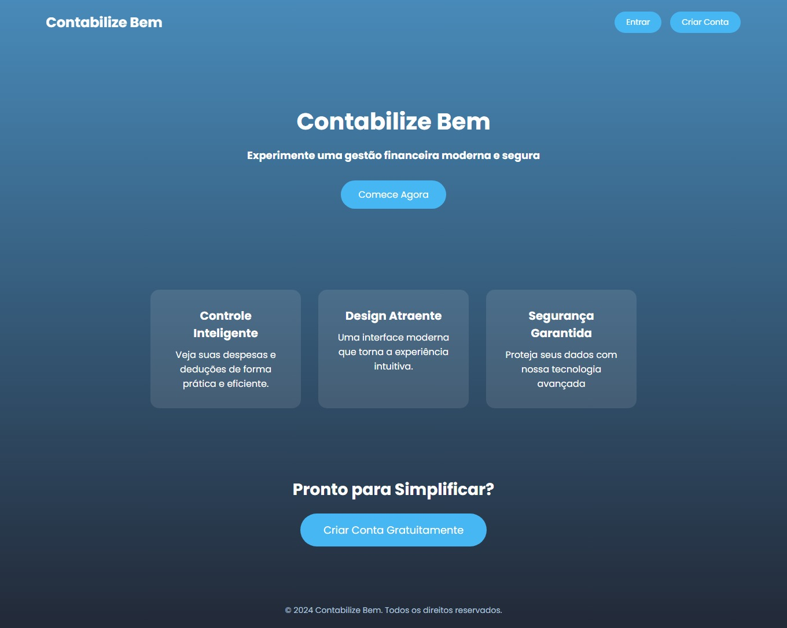
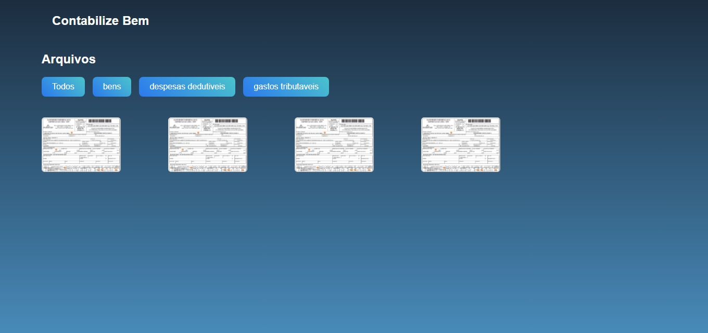
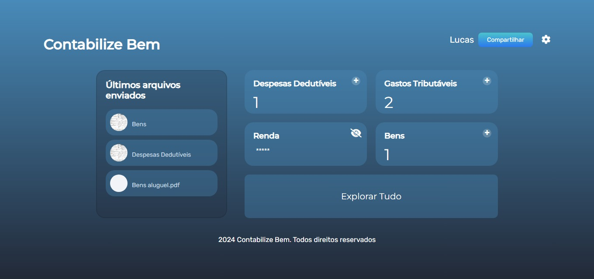
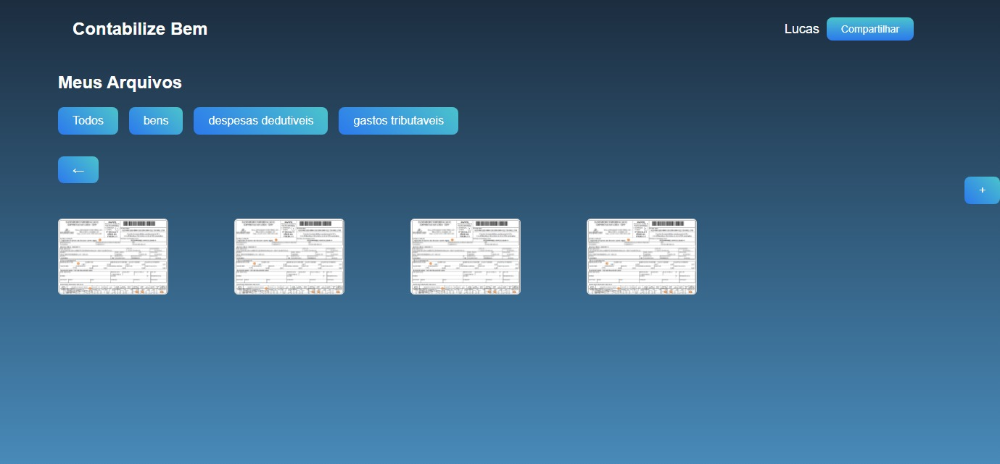
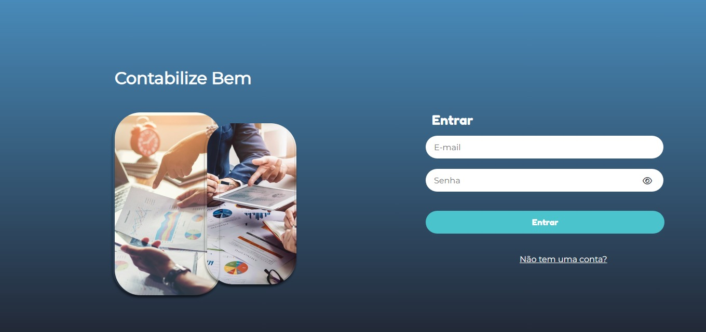
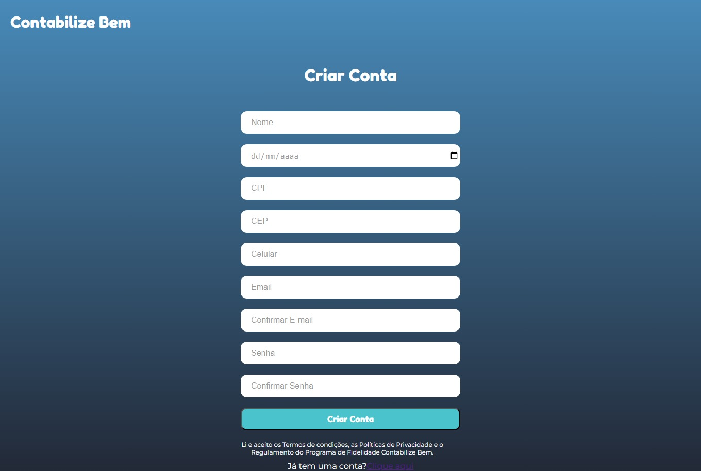
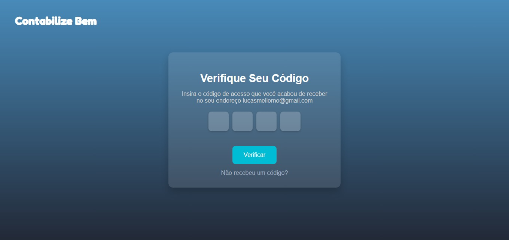
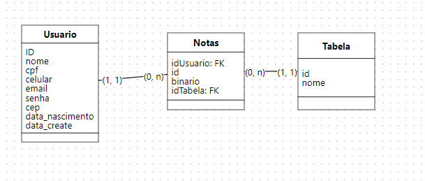

# Contabilize Bem - PMI
## Link para visualização do site: [contabilizebem](https://contabilizebem.squareweb.app)

## Aplicação de Organização Financeira e Documentos de IR

## Problema

Manter recibos, controlar rendimentos e organizar documentos ao longo do ano pode ser um grande desafio. Muitas vezes, essas informações acabam se perdendo ou não estão acessíveis de maneira organizada, dificultando a gestão financeira pessoal e a preparação da declaração de Imposto de Renda (IR).

## Solução

A aplicação oferece um site intuitivo e eficiente para armazenar e organizar documentos relacionados ao IR ao longo do ano.

### Benefícios:
- **Economia de tempo**: Redução do esforço necessário para encontrar e reunir documentos importantes.
- **Menos erros**: Minimização de equívocos na declaração de IR devido à centralização e organização dos dados.
- **Organização financeira**: Melhor controle dos documentos e rendimentos pessoais.
- **Facilidade para contadores**: Possibilidade de compartilhar os documentos organizados diretamente com o contador, simplificando o processo de análise.


---

## Capturas de Tela das Páginas

### Página Inicial (`/`)


### Página Compartilhado (`/compartilhado`)


### Página Home (`/home`)


### Página Notas (`/notas`)


### Página Login (`/login`)


### Página Criar Conta (`/criar_conta`)


### Página Verificação de E-mail (`/verify_email`)


---


## Contexto do Projeto

Este projeto foi desenvolvido como parte do **PMI** (Projeto Multidisciplinar Integrador) durante a Graduação em Análise e Desenvolvimento de Sistemas na **Universidade UNICESUSC**. 

O **PMI** é uma disciplina que substitui o Trabalho de Conclusão de Curso (TCC). A matéria começa no primeiro semestre com a idealização do projeto, passando por etapas de planejamento e desenvolvimento, e termina com a entrega do **MVP** (Produto Mínimo Viável).


## Instalação
Execute os seguintes comandos para instalar as dependências necessárias:

```r 
- pip install -r requirements.txt
```

## Estrutura de Pastas
1. config
    - Contém as configurações do banco de dados e a secret key.

2. forms 
    - Gerencia os formulários HTML
        1. Adiciona usuários ao banco de dados.

3. models
    - Define a estrutura ORM do banco de dados.

4. services
    - Funções úteis para o projeto.
        1. cpf_validator: Verifica se o CPF é válido.
        2. email_service: Cria o corpo do e-mail.
        3. password_validator: Verifica se a senha segue as diretrizes de segurança.
        4. send_verification_email: Envia o e-mail de verificação.
        5. idade: contem um calculo de idade.
        6. gerar_link: gera o link de compartilhamento das notas fiscais 

5. templates 
    - Arquivos do frontend (HTML).

7. static
    - Arquivos imagens, CSS e JavaScript(Voltado ao Front)

6. sql
    - Scripts SQL.

## Pasta /docs
- Contem os seguites arquivos:
1. Modelagem do Banco de dados | BD_modelagem.png
2. Contrato do servido | CONTRATO DE ADESÃO DE USO DE APLICATIVO.docx
3. Ponto de função | ponto-de-funcao.jpeg
4. Slide | Slide.pdf

## Modelagem Banco de Dados




## Ponto de função:


## Integrantes:

- Lucas Mello:  
[Github](https://github.com/LucasMe110)  
[Linkedin](https://www.linkedin.com/in/lucas-mello-muller-de-oliveira-5a0b24225/)

- Pedro Renner:  
[Github](https://github.com/RennerPedro)  
[Linkedin](https://www.linkedin.com/in/pedro-henrique-renner-030619213/)

- Nicolas Santos:  
[Github](https://github.com/nicoolassantos)  
[Linkedin](https://www.linkedin.com/in/nicolas-santos-0141362a0/)

- Eduardo Smyk:  
[Github](https://github.com/Eduardosmyk)  
[Linkedin](https://www.linkedin.com/in/eduardo-smyk-ba0a1a1b9/)
