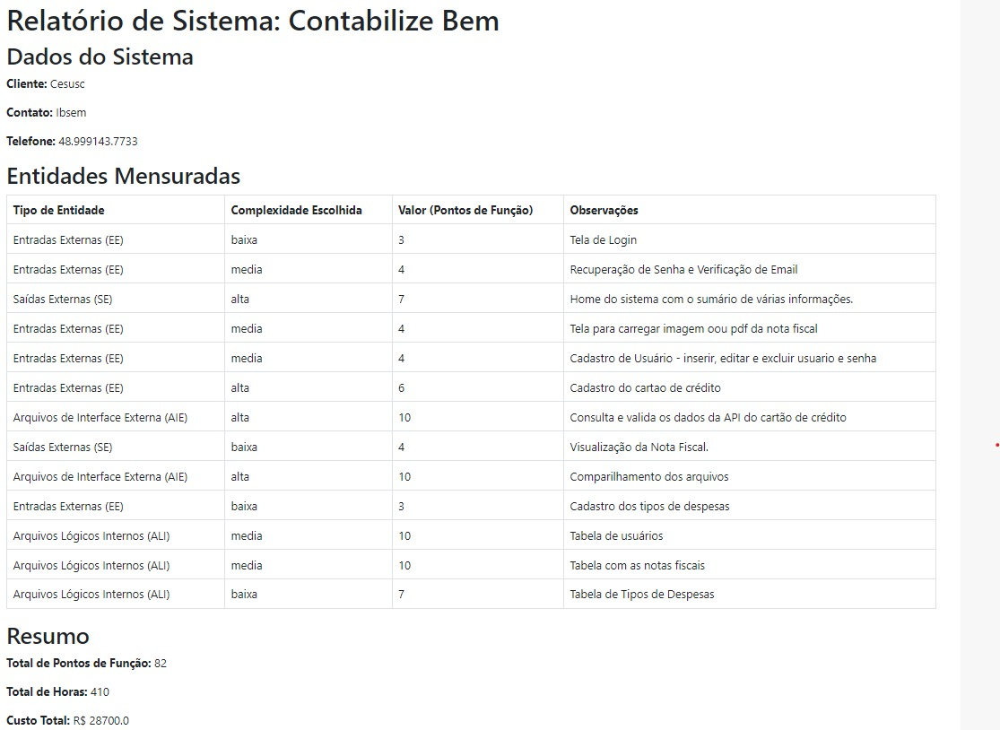

# Contabilize Bem - PMI

## Link para visualização do site: [contabilizebem](https://contabilizebem.squareweb.app)

## O'que é:

Meu PMI consiste em desenvolver um sistema que organize dados fiscais de forma prática e eficiente. A ideia é criar um ambiente onde as pessoas possam adicionar e gerenciar suas informações fiscais de maneira estruturada, facilitando o trabalho dos contadores. Com isso, busco simplificar o acesso e a consulta de dados, minimizando erros e otimizando o tempo desses profissionais, o que contribui para um processo fiscal mais preciso e ágil. Esse sistema será entregue como um software completo, substituindo o trabalho tradicional de conclusão de curso.

## Instalação
Execute os seguintes comandos para instalar as dependências necessárias:

```r 
- pip install -r requirements.txt
```
####  OU

```r 
- pip install Flask Flask-SQLAlchemy
```
```r
- pip install SQLAlchemy
```
```r 
- pip install numpy
```
```r 
- pip install cryptography
```

```r 
- pip install python-dotenv
```

```r 
-pip install flask-login
```

## Estrutura de Pastas
1. config
    - Contém as configurações do banco de dados e a secret key.

2. forms 
    - Gerencia os formulários HTML
        1. Adiciona usuários ao banco de dados.

3. models
    - Define a estrutura do banco de dados.

4. services
    - Funções úteis para o projeto.
        1. cpf_validator: Verifica se o CPF é válido.
        2. email_service: Cria o corpo do e-mail.
        3. password_validator: Verifica se a senha segue as diretrizes de segurança.
        4. send_verification_email: Envia o e-mail de verificação.
        5. idade: contem um calculo de idade.

5. templates 
    - Arquivos do frontend (HTML).

7. static
    - Arquivos CSS e JavaScript(Voltado ao Front)

6. sql
    - Scripts SQL.


## Ponto de função:



## Integrantes:

- Lucas Mello:  
[Github](https://github.com/LucasMe110)  
[Linkedin](https://www.linkedin.com/in/lucas-mello-muller-de-oliveira-5a0b24225/)

- Pedro Renner:  
[Github](https://github.com/RennerPedro)  
[Linkedin](https://www.linkedin.com/in/pedro-henrique-renner-030619213/)

- Nicolas Santos:  
[Github](https://github.com/nicoolassantos)  
[Linkedin](https://www.linkedin.com/in/nicolas-santos-0141362a0/)

- Eduardo Smyk:  
[Github](https://github.com/Eduardosmyk)  
[Linkedin](https://www.linkedin.com/in/eduardo-smyk-ba0a1a1b9/)


gfdgdgfdgfdg